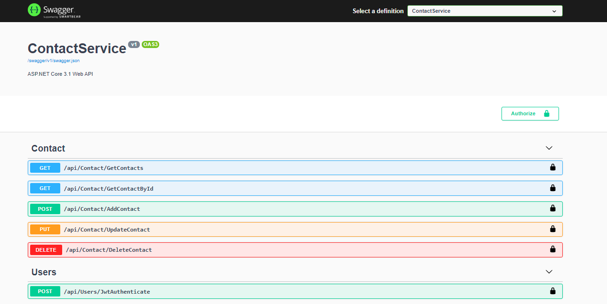
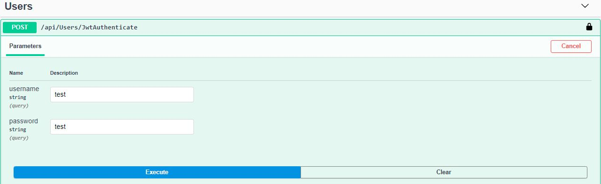
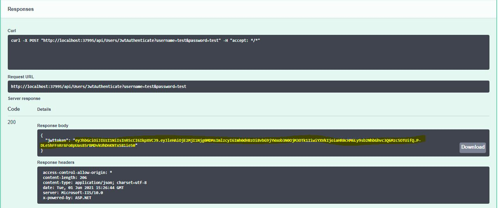
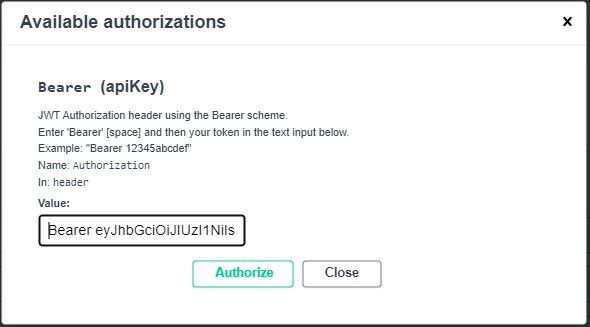

# Contact
##Contact REST API

This Web API developed in Asp.net Core 3.1 and Sql Server database. It uses 'Code First' development approach. This web api project written in visual studio 2019 and I have secure endpoint using JWT. Application is made of following tools.

1. Swagger: Swagger is used for documenting restful API that enables team to test API endpoint.
2. JWT Authentication: JWT (Json Web Token) is used for authentication and authorization.
3. Entity Framework Core: EF Core 3.1.6 is used as Object Relational Mapper (ORM) that simplifies mapping between objects in application to the tables and columns of a relational database.
4. NLog: Nlog is used for logging errors, warnings, and information.
5. Repository Pattern: Repository is used to create abstraction between business logic and data access layer. In this application using generic repository for most common type of database CRUD operation. 
6. Unit of Work Pattern: Unit of Work is used for effective implementation of the generic repository�pattern.

##Testing

To create database objects run the following commands in Nugget package manager console
* Add-Migration 
* Update-Database

Open and run the solution in visual studio 2019, Swagger UI is displayed.
 

In the 'Users' section click on POST button of JwtAuthenticate endpoint enter the following user credential to generate JWT token.

Username: test

Password: test

Copy the Jwttoken and click on Authorize button at the top, authorization popup is displayed enter Bearer + token  and authorize the api endpoint access. 

Once the API endpoints gets authorized you may test the below end points.

 
